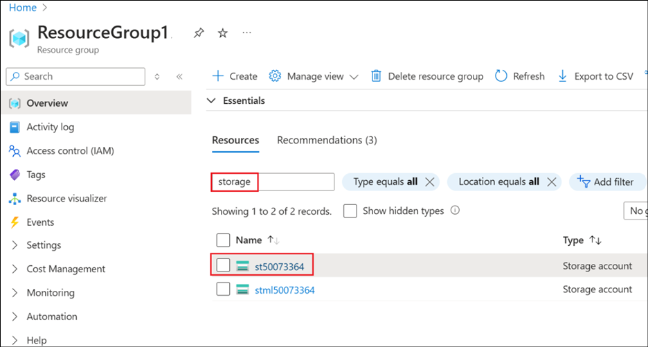

# Lab 5 - Azure AI Foundry end-to-end baseline reference implementation

**Introduction:**

This reference implementation demonstrates how to author and run various
AI-driven applications, including chat applications, using Azure AI
Foundry and OpenAI within a single region. It offers a secure and
private environment suitable for enterprises.


**Objective:**

The implementation covers the following scenarios:

1.  Testing/Authoring using AI Foundry Chat Playground

2.  Authoring a flow - Authoring a flow using prompt flow in an Azure AI
    Foundry

3.  Deploying a flow to Azure AI Foundry - The deployment of an
    executable flow to an Azure AI Foundry online endpoint. The client
    UI that is hosted in Azure App Service accesses the deployed flow.

## Exercise 1: Complete the set up and Deploy the infrastructure

### Task 1: Register Resource providers and assign roles

1.  Login to the Azure portal at +++https://portal.azure.com+++ using
    the login credentials,

    - Username - +++@lab.CloudPortalCredential(User1).Username+++

    - Password - +++@lab.CloudPortalCredential(User1).Password+++

2.  Select **Subscriptions** and select your assigned subscription.

    

    

3.  From the left navigation pane, select **Resource providers** under
    **Settings**. Search for and select +++**AlertsManagement**+++ and
    **Register** the same.

    

    

4.  Similarly, register the Resource providers
    +++Microsoft.StreamAnalytics+++,+++ Microsoft.PolicyInsights+++ and
    +++Microsoft.Cdn+++.

5.  Go to the Home page of the Azure portal, select Resource Groups and
    select your assigned **Resource Group**.

    

6.  Select **Access control(IAM)** from the left pane, select the **drop
    down** next to **Add** and click on **Add role assignment** to add a
    new role to your account.

    

7.  Select **Privileged administrator roles**, search for
    +++**owner**+++, select **LOD owner** and click on **Next**.

    

8.  Click on **+ Select members**. In the **Select members** dialog that
    opens, search for <+++@lab.CloudPortalCredential(User1).Username>+++
    and select. Click on **Select**. Click on **Next** to move to the
    next screen.

    

    

9.  In the Add role assignment – Conditions tab, select the **Allow user
    to assign all roles (highly privileged)** option and click on
    **Next**.

    

10. In the next screen, select **Assignment type** as **Active** and
    **Assignment duration** as **Permanent** and click on **Next**.

    

11. Select **Review + assign** to get the role assigned and wait for a
    success message.

    

    

### Task 2: Create CloudShell storage and clone the repo

1.  From the Azure portal Home page, click on the **Cloud Shell** icon
    to open the Cloud Shell and select **Bash** in the Welcome to Azure
    Cloud Shell dialog.

    

2.  Select **Mount storage account** option and select your assigned
    subscription from the drop-down menu.

    

3.  Select **We will create a storage account for you** option and click
    on **Next**.

    

    

4.  Once the creation is done and the Cloud Shell pane opens. Click on
    **Editor** and select **Confirm** in the **Switch to Cloud Shell**
    confirmation dialog. We will need the Editor mode to edit the files
    for the deployment.

    

    

5.  Execute the following commands to clone the repository from GitHub
    to your CloudShell storage and then navigate to the cloned folder.

    +++git clone https://github.com/technofocus-pte/aistudio-end-to-end-baseline-architecture.git+++

    +++cd aistudio-end-to-end-baseline-architecture/+++

    

6.  Execute the below commands and follow the prompts to login to Azure
    from CLI and set the subscription to your subscription

    +++az login+++

    +++az account set --subscription @lab.CloudSubscription.Id+++

    

    

### Task 3: Obtain the App Gateway certificate

1.  Follow the steps below to obtain the **App Gateway certificate**.

2.  Execute the below command to set a variable for the domain used in
    the rest of this deployment.

    +++export DOMAIN_NAME_APPSERV_BASELINE="contoso.com"+++

3.  Execute the below command to generate a client-facing, self-signed
    TLS certificate.

    ```
    openssl req -x509 -nodes -days 365 -newkey rsa:2048 -out appgw.crt -keyout appgw.key -subj "/CN=${DOMAIN_NAME_APPSERV_BASELINE}/O=Contoso" -addext "subjectAltName = DNS:${DOMAIN_NAME_APPSERV_BASELINE}" -addext "keyUsage = digitalSignature" -addext "extendedKeyUsage = serverAuth"
    openssl pkcs12 -export -out appgw.pfx -in appgw.crt -inkey appgw.key -passout pass:

    ```

    

4.  The below command is to Base64 encode the client-facing certificate.
    Execute it.

    ```
    export APP_GATEWAY_LISTENER_CERTIFICATE_APPSERV_BASELINE=$(cat appgw.pfx | base64 | tr -d '\n')
    echo $APP_GATEWAY_LISTENER_CERTIFICATE_APPSERV_BASELINE

    ```

5.  Save the output of the above command to a notepad as
    **appGatewayListenerCertificate**.

    

6.  Execute the below command to get your **object id** and save the
    output to a notepad.

    +++echo $(az ad signed-in-user show --query id -o tsv)+++

    

7.  Click on **Open editor** icon from the Cloud Shell.

    

8.  Navigate to the **parameters.json**
    (aistudio-end-to-end-baseline-architecture -\> infra-as-code -\>
    bicep -\> parameters.json)

    

9.  Add the **appGatewayListenerCertificate** value saved earlier as the
    value to appGatewayListenerCertificate field. Add the **object id**
    value as value to the userObjectId field.

    

10. Right click, select **Save** and then **Quit** the editor.

### Task 4: Deploy the infrastructure

1.  Execute the following command to deploy the infrastructure.

    ```
    RESOURCE_GROUP=@lab.CloudResourceGroup(ResourceGroup1).Name
    BASE_NAME=@lab.LabInstance.Id

    az deployment group create -f ./infra-as-code/bicep/main.bicep \
    -g $RESOURCE_GROUP \
    -p @./infra-as-code/bicep/parameters.json \
    -p baseName=$BASE_NAME

    ```

    The deployment takes around 45 minutes to complete

    

2.  Once the deployment succeeds, the details get populated in the Cloud
    Shell. Review the details.

    

    

3.  From your Resource group, select **Deployments** from the left pane
    and browse through the details.

    

    

4.  Click on **Overview** from the left pane and browse through the
    resources that are created from the deployment.

    

    

5.  After deployment from the AI Search resource, the **Private Shared
    links** needs to be **approved** **manually**.

6.  Type +++search+++ in the **Search** box under the **Resources** and
    select the resource
    ai-search[@lab.LabInstance.Id](mailto:BASE_NAME=@lab.LabInstance.Id)

    

7.  Select **Networking** under **Settings** from the left navigation
    pane and select the **Shared private access** pane. Notice that the
    **Connection state** is in **Pending** state for all the Private
    Shared links.

    

8.  Follow the steps below to manually approve them.

9.  From the resource list of the Resource group, search for and select
    the storage account,
    +++st[@lab.LabInstance.Id](mailto:BASE_NAME=@lab.LabInstance.Id)+++

    

10. Select the **Private endpoint connections** tab, select the one
    whose Connection state is in **Pending** state and click on
    **Approve** to approve it.

    

11. Select **Yes** in the Approve connection dialog box.

    

12. Similarly **Approve** the pending approvals for the storage account
    +++stml[@lab.LabInstance.Id](mailto:BASE_NAME=@lab.LabInstance.Id)+++,
    +++oai-[@lab.LabInstance.Id](mailto:BASE_NAME=@lab.LabInstance.Id)+++,
    +++ai[@lab.LabInstance.Id](mailto:BASE_NAME=@lab.LabInstance.Id)+++

13. The
    ai-search[@lab.LabInstance.Id](mailto:BASE_NAME=@lab.LabInstance.Id)
    resource -\> Networking -\> Shared private access, should look like
    the one in the screen shot below.

    

## Exercise 2: Connect to Azure AI Foundry, work with Prompt flow and publish the chat app

### Task 1: Connect to Azure AI Foundry

In this case, the author connects to the virtual network through Azure
Bastion and a virtual machine jumpbox. Connectivity to the virtual
network is more commonly done in enterprises through ExpressRoute or
virtual network peering.

The diagram below, illustrates how Azure AI Foundry is configured for
Managed virtual network isolation. With this configuration, a managed
virtual network is created, along with managed private endpoints
enabling connectivity to private resources such as the workplace Azure
Storage and Azure Container Registry. You can also create user-defined
connections like private endpoints to connect to resources like Azure
OpenAI Service and Azure AI Search (previously named Cognitive Search).


1.  From the Resourcegroup, search for +++virtual machine+++ and select
    the resource vm-jmp-@lab.LabInstance.Id.

    

2.  Select the drop down next to **Connect** and select **Connect via
    Bastion.**

    

3.  Provide the below details and click on Connect to connect to the VM.

    - Username - +++vmadmin+++

    - Password - +++jmPSecureST98+++

    

4.  Select **Allow** in the pop up.

    

5.  Once logged in, scroll down and click on **Accept** in the pop up.

    

6.  Open the Edge browser from the desktop and select **Start without
    your data**.

    

7.  Select **Confirm and continue** and then **Confirm and start
    browsing** in the next screen.

    

    

8.  From the VM’s browser, login to the Azure portal at
    +++https://portal.azure.com+++ using,

    - Username - +++@lab.CloudPortalCredential(User1).Username+++

    - Password - <+++@lab.CloudPortalCredential(User1).Password>+++

9.  Search for +++hub+++ and select the **aihub-lab.LabInstance.Id**
    resource.

    

10. Select Launch **Azure AI Foundry**.

    

11. Select **Connected resources** from the left pane. We need to create
    a new AI Search Connection. Select **+ New connection**.

    

12. Select **Azure AI Search**.

    

13. In the **Connect an Azure AI Search resource** pane, click on **Add
    connection**.

    

14. Once connected, **Close** the Connect an Azure AI Search resource
    dialog. (Reduce the **Zoom** **size** of the browser if the Close
    button is not visible).

    

15. In the **Manage connected resources in this hub** screen, confirm
    that the **aisearch** resource is now available in the connected
    resources list.

    

16. Select **Create project** to create a new project in the **Azure AI
    Foundry**.

    

17. Give the project name as <+++project-@lab.LabInstance.Id>+++ and
    select **Create project**.

    

18. Once the project is created, click on **Close** in the **Explore and
    experiment** dialog.

    

    

19. Select **Playgrounds** from the left navigation pane and select the
    **Try the Chat playground** option.

    

    

    

20. Ask questions and chat in the playground here. Ask a question like
    +++What is Azure OpenAI?+++ and look for the response from the
    model.

    

### Task 2: Create, test, and deploy a Prompt flow 

1.  From the left navigation pane, select **Prompt flow** and select **+
    Create**.

    

2.  **Clone** the **Chat with Wikipedia** flow. **Name** the flow as
    +++chat_wiki+++ and click on **Clone.**

    

    >[!Note] **Note:** If you face a **CloudDependencyPermission** error, cancel the
    cloning and redo it with a different name **after** waiting for **few
    minutes**.

    

3.  Update the values in **extract_query_from_question** as below.

    - Connection – Select
    **aihub-@lab.LabInstance.Id-connection-Aiservices_aoai**

    - deployment_name – Select **gpt4**

    - max_tokens - +++256+++

    

4.  Update the values in **augmented_chat** as below.

    - Connection – Select
    **aihub-@lab.LabInstance.Id-connection-Aiservices_aoai**

    - deployment_name - **gpt4**

    - max_tokens – +++256+++

    

5.  Click on the **Save** icon to save the changes.

    

6.  Select **Start compute session**.

    

7.  Wait for the runtime to be created. It will take around 10 minutes
    to complete.

    

8.  Explore the **Chat** option.

    

    

### Task 3: Deploy to Azure AI Foundry managed online endpoint

1.  Click on **Deploy** from the UI.

    

2.  In the Deploy chat_wiki screen, provide the below details and click
    on **Review + Create**.

    - Endpoint name - +++ept-@lab.LabInstance.Id+++

    - Deployment name - <+++ept-@lab.LabInstance.Id-1>+++

    - Virtual machine – Select **Standard_DS3_v2**

    

3.  Review the settings and click on **Create**.

    

    

4.  Ensure that the **deployment** gets **succeeded**.

    

### Task 4: Publish the Chat front-end web app

1.  We need to upload the file to the storage account. The deployed
    storage account does not allow public access, so you will need to
    temporarily allow access from your IP address.

2.  You must authorize your user to upload a blob to the storage
    account.

3.  Execute the below command to find the IPAddress of the
    **CloudShell**.

    +++curl -s https://ipinfo.io/ip+++

    

4.  From the Storage account, <st@lab.LabInstanceId>, select Networking
    under **Security + networking**. **Under Firewalls and virtual
    networks**, select the option **Enabled from selected virtual
    networks and IP addresses**.

    

5.  Scroll down and under the **Firewall** section, select **Add your
    Client IP address** and then add the **Cloud Shell’s IP address**
    under the **Address range**.

    

6.  Scroll up and **Save** the changes.

    

7.  Execute the below command to assign **Storage Blob Contributor**
    role to the user in order to give the logged-in user permission to
    upload a blob.

    ```
    STORAGE_ACCOUNT_PREFIX=st
    BASE_NAME=@lab.LabInstanceId
    RESOURCE_GROUP=@lab.CloudResourceGroup(ResourceGroup1).Name
    NAME_OF_STORAGE_ACCOUNT="$STORAGE_ACCOUNT_PREFIX$BASE_NAME"

    # Get your signed-in user's object ID
    USER_ID=$(az ad signed-in-user show --query id -o tsv)

    # Get the storage account's full resource ID
    STORAGE_ACCOUNT_ID=$(az storage account show \
    --name $STORAGE_ACCOUNT_PREFIX$BASE_NAME \
    --resource-group $RESOURCE_GROUP \
    --query id -o tsv)

    # Assign the required role
    az role assignment create \
    --assignee $USER_ID \
    --role "Storage Blob Data Contributor" \
    --scope $STORAGE_ACCOUNT_ID
    ```

    

8.  Execute the below command to upload the zip file
    ./website/chatui.zip to the existing deploy container and tell the
    web app to restart.

    ```
    WEB_APP_PREFIX=app-
    NAME_OF_WEB_APP="$WEB_APP_PREFIX$BASE_NAME"
    LOGGED_IN_USER_ID=$(az ad signed-in-user show --query id -o tsv)
    RESOURCE_GROUP_ID=$(az group show --resource-group $RESOURCE_GROUP --query id -o tsv)

    az storage blob upload -f ./website/chatui.zip \
    --account-name $NAME_OF_STORAGE_ACCOUNT \
    --auth-mode login \
    -c deploy -n chatui.zip

    az webapp restart --name $NAME_OF_WEB_APP --resource-group $RESOURCE_GROUP

    ```

    

    

### Task 5: Validate the web app

1.  This section will help you to ensure that the workload is exposed
    correctly and responding to HTTP requests.

2.  Get the public IP address of the Application Gateway be executing
    the command below. Save the output to a notepad.

    ```
    APPGW_PUBLIC_IP=$(az network public-ip show --resource-group $RESOURCE_GROUP --name "pip-$BASE_NAME" --query [ipAddress] --output tsv)
    echo APPGW_PUBLIC_IP: $APPGW_PUBLIC_IP
    ```

3.  Create an A record for DNS. From your VM, navigate to
    **C:\Windows\System32\drivers\etc\hosts** and add the following
    entry to the end of it, replacing \<APPGW_PUBLIC_IP\> with the
    output received in the last step.

    +++<APPGW_PUBLIC_IP> www.contoso.com+++

4.  Browse to the site, +++https://www.contoso.com+++

5.  It may take up to a few minutes for the App Service to start
    properly. A TLS warning will be present due to using a self-signed
    certificate. You can ignore it or import the self-signed cert
    (appgw.pfx) to your user's trusted root store.

**Summary:**

In this lab, we have deployed the AI Foundry end to end baseline
reference architecture, worked with the Azure AI Foundry chat, Prompt
flow and deployed the flow as an Azure AI Foundry managed online
endpoint and published it to chat front-end web app.
