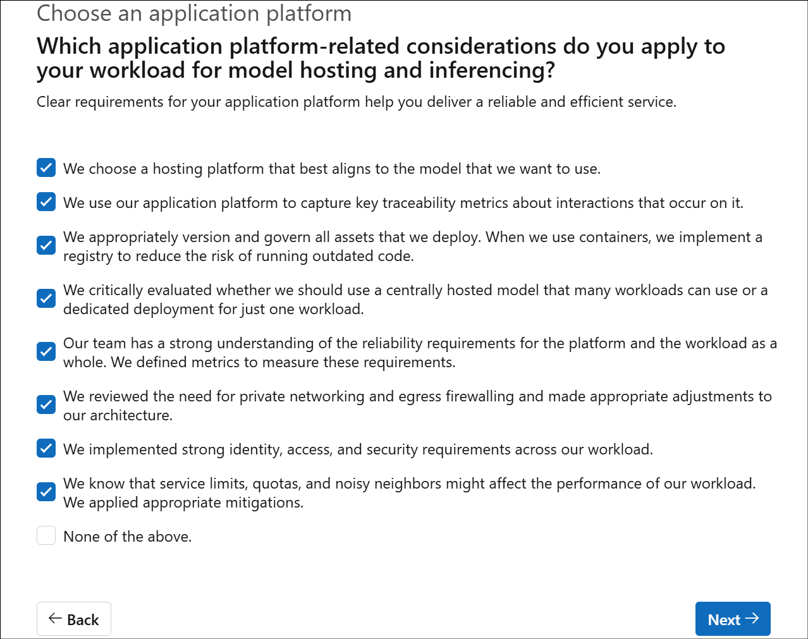
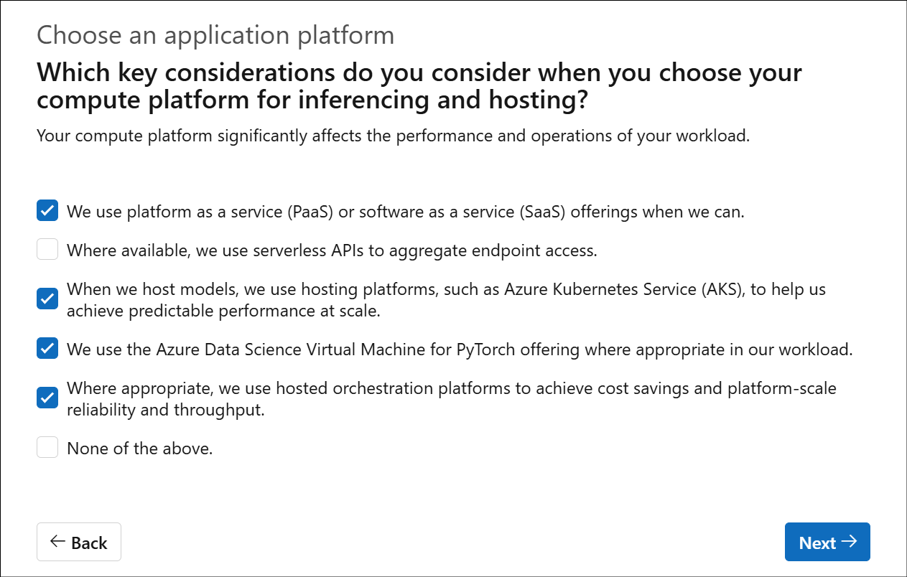
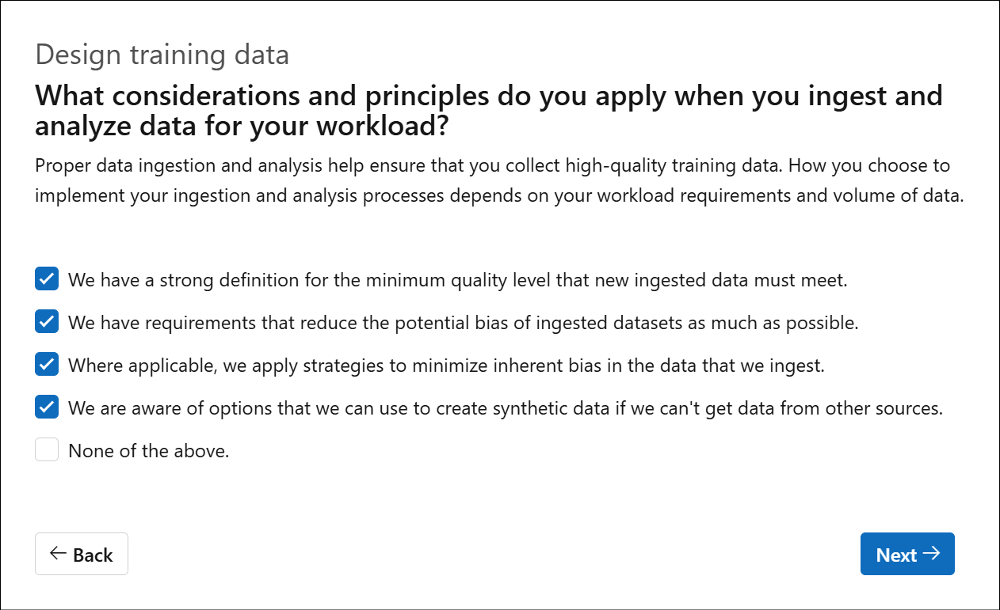

# Lab - WAF AI Workload assessment

1.  From a browser, navigate to
    +++https://learn.microsoft.com/en-us/assessments/ea306cce-c7fa-4a2b-89a6-bfefba6a9cf4/+++
    and select Start Assessment.

2.  Select **Sign in** to start.

3.  Signing in using personal id is encouraged so that the data can be
    retained.

4.  There are different categories of questions.

5.  Select an option for each of the questions based on your workload
    requirements like in the screenshots below.

## Task 1: Design your AI application

1.  ewwqewq

- **Data-processing microservices** —  
  These are usually containerized to allow scalable, flexible
  pipelines.  
  (Examples: ETL services, pre-processing APIs.)

- **Model-inferencing microservices** —  
  AI models are very commonly deployed inside containers (especially for
  Kubernetes / AKS deployment scenarios, or Azure ML Online Endpoints).

- **User-authentication microservices** —  
  If you have a custom authentication service (say, identity brokering,
  OAuth flows), it makes sense to containerize it.

- **Data-processing pipelines** —  
  Depending on the architecture, portions of a data pipeline (not entire
  systems like ADF) may be containerized, especially for heavy
  preprocessing tasks.

2.  Which factors influence your decision to colocate AI components with
    other workload components?

- **Low Latency Requirements** —  
  Inference (especially real-time) benefits greatly when the model and
  the application are close together (e.g., on the same VM, same
  Kubernetes node, or same region), minimizing network hops.

- **High Dataset Access Frequency + Performance Requirements** —  
  If the model frequently reads large datasets (e.g., real-time
  recommendations, search, personalization), colocating it near the
  storage (blob storage, database) drastically improves performance and
  reduces bandwidth costs.

- **Complementary Resource Needs** —  
  AI models (high GPU use) and some app services (high memory, or
  I/O-bound) might be balanced together onto the same underlying compute
  — helping you fully utilize expensive VMs or AKS node pools.

3.  What aspects of your workload make an orchestrator an ideal design
    choice?

- **Multistep workflow** —  
  In AI applications, it’s common to have data ingestion → preprocessing
  → model inference → post-processing → results storage steps.  
  Orchestrators like **Azure Machine Learning Pipelines**, **Durable
  Functions**, or **Kubernetes Operators** help manage these steps.

- **Conditional Logic** —  
  Many AI workflows branch based on results (e.g., "if model confidence
  \< threshold, then escalate to human review").

- **Stateful** —  
  Workflows often need to remember intermediate results across steps
  (e.g., batch job ID, user session context), which orchestration
  handles cleanly.

- **Retrieval of Augmentation Data** —  
  Before or after inference, sometimes additional data is pulled (e.g.,
  enrich input features with external API or database calls).

- **Multiple Models** —  
  If your app uses an ensemble of models (e.g., classification +
  personalization + ranking), orchestration is needed to manage the
  sequence and aggregation of outputs.

4.  What aspects of your workload make an API gateway an ideal design
    choice?

- **Manage Multiple Microservices** —  
  In your AI solution, you likely have multiple services: data
  preprocessing APIs, model inference APIs, authentication APIs — all
  exposed separately.  
  An API Gateway (like **Azure API Management**) can consolidate these
  under a single endpoint.

- **Manage Traffic Across APIs** —  
  Load balancing, rate limiting, throttling, and routing based on
  traffic type (e.g., mobile users vs internal batch jobs) are handled
  efficiently by a gateway.

- **Enhance API Security** —  
  API gateways enforce OAuth2, validate JWT tokens, apply IP filtering,
  and even integrate with WAF (Web Application Firewall) policies.  
  They act as the **security front door** to your microservices —
  crucial for AI workloads that often expose sensitive business logic or
  customer data.

5.  Which design patterns best suit your workload?

- **Model Ensembling** —  
  Many AI solutions use multiple models to improve accuracy (e.g.,
  combining classifiers, ranking models, anomaly detectors).  
  Especially common in production-grade AI systems.

- **Microservices Architecture** —  
  You already have independently deployed components (data processing,
  inferencing, user auth), which is the essence of a microservices
  approach.

- **Event-driven Architecture** —  
  In Azure, services like Event Grid, Event Hubs, and Service Bus are
  often used for decoupling AI workflows — for example:

  - Ingest event → Trigger pre-processing → Run inferencing →
    Post-processing

  - Scaling based on events (e.g., new data arrival triggers retraining)

- **Retrieval-Augmented Generation (RAG)** —  
  If your workload uses **generative AI** (e.g., Azure OpenAI + your
  private data sources), RAG is a best practice. Even if not fully
  GenAI-based now, RAG is becoming a *standard* for knowledge-augmented
  AI.

6.  Which factors influence your choice of frameworks and libraries?

- **Application requirements limit framework options** —  
  Some AI solutions require certain frameworks based on performance or
  compatibility (e.g., using PyTorch or TensorFlow because a model was
  trained there, or ONNX for optimized inferencing).

- **Specific integration requirements** —  
  If you need integration with Azure services like Azure Machine
  Learning, Azure Kubernetes Service (AKS), or Azure App Services, some
  libraries (like Azure SDKs, MLflow, Hugging Face transformers) are
  better suited.  
  Also, some enterprise environments require compatibility with logging,
  monitoring, security libraries.

- **Experience and expertise** —  
  Choosing libraries that the team is already skilled in (e.g., PyTorch,
  FastAPI, scikit-learn) speeds up development, reduces bugs, and lowers
  operational risks.

7.  Which nonfunctional requirements must your workload meet?

- **Low-Latency Requirements** —  
  For real-time inferencing, user-facing apps, or internal tools with
  fast response expectations, **low latency** is critical (especially if
  models are used in production).

- **Token or Throughput Limitations** —  
  If you use Azure OpenAI, standard Azure ML inferencing, or any SaaS
  APIs (e.g., cognitive services), there are **token limits**, **rate
  limits**, and **throughput caps**.  
  Your design must avoid service degradation during peak loads.

- **Cost Chargebacks** —  
  In larger organizations, it’s common to **track AI resource usage**
  per team, department, or project — and **bill them back**.  
  Azure Cost Management + resource tagging (e.g., with CostCenter or
  ProjectID tags) supports this nicely.  
  This is a typical nonfunctional requirement for enterprise-grade
  workloads.

## Task 2: Choose an application platform

1.  Which considerations do you apply when you build and run your
    exploratory data analysis (EDA) platform?

**Transient workspaces and compute** —  
Azure Machine Learning (AML) supports easy spin-up and shutdown of
compute instances for cost optimization.

**On-demand GPUs** —  
Data scientists often require GPU-powered VMs for deep learning and
complex data exploration — available in AML.

**Key metrics tracking during preprocessing** —  
Azure ML Pipelines or Tracking APIs allow recording of metrics (like
missing values filled, feature importance, etc.).

**Full experiment recording** —  
Reproducibility is crucial for compliance and model governance. Azure ML
captures code, parameters, environment, data references automatically.

**Collaboration features** —  
Shared workspaces, GitHub integration, MLflow tracking, commenting on
runs — these promote team collaboration.

**Data and model versioning** —  
Native in Azure ML (Datasets, Model registry).

**Strong access, authorization, encryption** —  
You apply RBAC, VNET integration, Private Link, Key Vault-backed
credentials to meet security requirements.

**Use of PaaS where possible** —  
You prefer using Azure-native services like Azure ML, Azure Blob
Storage, Azure Kubernetes Service — to maximize manageability and
reliability.

2.  When you train or fine tune your own models, which considerations do
    you apply for platform implementation and management?

- **Transient usage and resource allocation** —  
  Azure ML provides the flexibility to spin up and shut down **VMs, GPU
  instances, and clusters** on-demand, optimizing both costs and
  resource usage.

- **Orchestration of compute resources** —  
  Tools like **Azure ML Pipelines** and **Kubernetes (AKS)** allow you
  to schedule, manage, and orchestrate different stages of the training
  pipeline (e.g., data preprocessing, model training, model tuning).

- **Extensibility for adding technologies** —  
  Azure's ecosystem supports integration with **existing tools** like
  TensorFlow, PyTorch, and **Azure-native services** (like Databricks,
  Azure Blob, and Azure SQL). You can incorporate custom components and
  external resources seamlessly.

- **Tradeoff between cost and performance** —  
  You can choose from **different types of compute** (e.g., Standard
  VMs, GPU VMs, or ND-series for AI training) and adjust the **scale**
  based on **workload requirements**. Cost management tools allow
  setting **budget thresholds** and **performance objectives**.

- **Choosing the correct compute type** —  
  Azure ML provides deep **insight into available compute options**, so
  you can select between **CPU/GPU instances** based on model size,
  training time, and performance tradeoffs (e.g., for deep learning,
  GPUs are often optimal).

3.  Which application platform-related considerations do you apply to
    your workload for model hosting and inferencing?

- **Hosting platform selection** —  
  The **Azure Machine Learning service** or **Azure Kubernetes Service
  (AKS)** aligns with specific model needs (e.g., low-latency
  inferencing with AKS, large-scale batch processing with AML).  
  Choosing the right platform ensures optimized deployment for model
  types (e.g., TensorFlow, ONNX, etc.).

- **Capture traceability metrics** —  
  Azure ML's **experiment tracking** and **Application Insights** help
  capture metrics like request counts, inference latencies, and error
  rates, crucial for observability and debugging.

- **Versioning and governance** —  
  Versioning is key to reproducibility and auditing. Azure ML's **Model
  Registry** and **Azure Container Registry (ACR)** provide central
  version management and rollback capabilities to avoid outdated code.

- **Centrally hosted vs. dedicated model deployment** —  
  If the model is used across multiple workloads, a **centralized
  model** (deployed via Azure ML or AKS) might make more sense. For
  specific, isolated workloads, **dedicated deployment** on a private VM
  or node could be a better fit.

- **Reliability requirements** —  
  You need to define **availability SLA**, **uptime**, and **error
  tolerance metrics** based on the nature of your inferencing workload
  (e.g., real-time user-facing apps, batch inference).  
  This is monitored through **Azure Monitor**.

- **Private networking and firewalling** —  
  If security is critical (especially for sensitive models or data),
  **VNet integration**, **private endpoints**, and **egress firewalls**
  help ensure secure traffic flow and prevent unauthorized access.

- **Identity, access, and security** —  
  You should implement **RBAC** (Role-Based Access Control), **managed
  identities**, **Key Vault** for secrets, and **Azure AD** for
  authentication and authorization to secure model endpoints and prevent
  unauthorized access.

- **Service limits, quotas, and noisy neighbors** —  
  Consider **compute quotas**, **resource allocation** per model (e.g.,
  avoiding over-provisioned VMs), and possible **noisy neighbor**
  impacts in shared environments. Mitigations like **dedicated resource
  allocation** and **auto-scaling** can help.

4.  Which key considerations do you consider when you choose your
    compute platform for inferencing and hosting?

- **PaaS/SaaS Offerings** —  
  Leveraging **Azure PaaS** services (like **Azure Machine Learning** or
  **Azure Cognitive Services**) can help reduce operational overhead.
  **SaaS** APIs such as **Azure AI models** for text, vision, and speech
  provide ready-to-use functionality for quick inferencing.

- **Serverless APIs** —  
  If you're looking for flexibility, **serverless compute** options like
  **Azure Functions** or **Azure Logic Apps** allow you to run inference
  without needing to manage infrastructure. It’s ideal when you don’t
  need long-running services and want to pay only for actual usage.

- **Azure Kubernetes Service (AKS)** —  
  For hosting **scalable model inferencing services**, **AKS** is a
  great choice. It provides an elastic, reliable platform with the
  ability to manage multiple containerized models, ensuring high
  availability and performance under load.

- **Azure Data Science VM for PyTorch** —  
  If your models are built with **PyTorch**, the **Azure Data Science
  Virtual Machine** is optimized for training and deployment, equipped
  with all the necessary dependencies and libraries to help streamline
  the process.

- **Hosted Orchestration Platforms** —  
  Platforms like **Azure ML** or **AKS** with **Kubernetes** offer
  excellent orchestration features to scale out inferencing pipelines,
  optimize compute utilization, and manage workflows efficiently. This
  is key for handling large volumes of requests or batch processing with
  reliability.

## Task 3: Design training data

1.  What considerations and principles do you apply when you ingest and
    analyze data for your workload?

- **Minimum quality level for ingested data** —  
  Ensuring that the **quality of data** is high is crucial for training
  accurate models. This includes verifying the integrity, completeness,
  and consistency of the incoming data. Azure services like **Azure Data
  Factory** or **Azure Synapse Analytics** provide tools for
  transforming, validating, and cleaning data before it's used in
  training.

- **Reducing potential bias in ingested datasets** —  
  To ensure fairness and model integrity, you must carefully assess the
  **demographic balance** and **representation** of your training data.
  Using diverse, unbiased datasets is a key practice in responsible AI.
  Azure **Fairness Toolkit** and tools for model explainability (e.g.,
  **Azure ML Interpretability**) help evaluate and mitigate bias in the
  model.

- **Applying strategies to minimize inherent bias** —  
  Beyond just ingesting data, incorporating data **preprocessing**
  techniques like **oversampling/undersampling**, **data augmentation**,
  and **anonymization** can reduce the risk of training biased models,
  especially in domains like NLP or image recognition.

- **Synthetic data creation** —  
  In situations where acquiring real-world data is challenging (e.g.,
  privacy issues, rare events), generating **synthetic data** can be a
  good alternative. Tools like **Azure ML** or third-party libraries
  (e.g., **Augmentor**, **DeepSynthetic**) can be used to create
  realistic datasets that simulate real-world scenarios.

2.  How do you manage data collection and segmentation in your
    organization?

- **Production data and data-classification constraints** —  
  When using **production data** for training, it's important to ensure
  compliance with the **data classification** (e.g., PII, HIPAA, GDPR,
  etc.). **Azure Purview** and **Azure Information Protection** help
  classify and manage sensitive data effectively in accordance with
  regulations.

- **Data segmentation complying with security and regulatory
  requirements** —  
  **Data segmentation** must respect legal and regulatory standards,
  including those related to **data privacy** and **data residency**.
  Using **Azure Data Lake** or **Azure Synapse Analytics**, you can
  segment your data into partitions while adhering to **compliance** and
  security best practices.

- **Access controls for data subsets** —  
  **Role-Based Access Control (RBAC)** and **Azure Active Directory
  (AAD)** provide mechanisms to enforce access restrictions, ensuring
  only authorized personnel can interact with specific data. This is
  critical for maintaining **data security** and **privacy**, especially
  when dealing with sensitive datasets.

3.  What steps do you take to prepare your data for ingestion?

- **Quality requirements for ingested data** —  
  Before ingestion, data must meet specific **quality criteria** like
  completeness, consistency, and correctness. You can automate this with
  tools like **Azure Data Factory** for data validation and
  transformation.

- **Rescoping fields** —  
  **Data normalization** or **reshaping** (e.g., splitting an "address"
  field into "house number" and "street name") ensures that the dataset
  aligns with your model's specific needs. **Azure Databricks** or
  **Azure ML** can help with feature engineering and reshaping.

- **Removing duplicates** —  
  To **reduce noise** and **improve model performance**, removing
  duplicates is essential. This can be automated within **Azure Data
  Factory** or **Databricks** as part of the **data cleaning** pipeline.

- **Removing sensitive data** —  
  **PII** and other sensitive data must be securely removed or
  anonymized during data preparation to comply with data protection
  regulations. Tools like **Azure Purview** can help with **data
  classification**, and **Azure Key Vault** can securely manage
  sensitive information.

- **Data standardization** —  
  Ensuring that your data adheres to **consistent formats** (e.g., date
  formats, numerical precision, and categorical encoding) facilitates
  easier integration and analysis. Azure services like **Synapse
  Analytics** and **Azure ML** provide built-in transformations for data
  standardization.

4.  What strategies do you use for data maintenance and retention?

- **Data-retention strategy aligned with regulatory requirements** —  
  Data retention policies must be in place to comply with
  **regulations** (e.g., GDPR, HIPAA) while addressing the **functional
  needs** of your workload. **Azure Data Lake** and **Azure Blob
  Storage** offer lifecycle management features that allow you to
  retain, archive, or delete data based on your defined retention
  policies.

- **Tracking data lineage** —  
  Data lineage tracking helps ensure transparency and traceability for
  the data flowing into the model. **Azure Purview** is a powerful tool
  for managing **data governance** and ensuring that you understand the
  source, transformations, and potential biases in your data. This is
  also crucial for debugging model errors.

- **Evaluating model performance** —  
  Continuously monitoring model performance is essential for maintaining
  accuracy. Azure tools like **Azure ML**'s **Model Monitoring** allow
  you to track inference accuracy over time and trigger retraining
  processes if performance degrades.

- **Efficient processes for data removal** —  
  You should have clear processes for deleting data that is no longer
  needed, particularly when dealing with **PII** or **sensitive data**.
  **Azure Purview** can be used for tracking and ensuring compliance
  with **data deletion policies**.

- **Clear retraining procedures** —  
  Retraining models based on new data or performance degradation is a
  crucial part of maintaining an AI system. A well-defined retraining
  **trigger** (e.g., changes in data distribution, accuracy drops)
  should be in place, and you can automate this with **Azure Machine
  Learning pipelines**.

- **Using platform tools for lineage and retention** —  
  Utilizing tools like **Azure ML**, **Azure Data Factory**, and **Azure
  Purview** can help automate the management of **data retention** and
  **lineage tracking**, ensuring the correct data is retained, and its
  history is well-documented.

6.  Fill in the remaining sections based on the deployed infrastructure.

7.  Once all the questions are answered, you will receive the results
    based on your requirements, categorized appropriately with
    recommendations for each.

8.  Scroll down to know more details on the same.

**Summary:**

In this lab, we have deployed the AI Foundry end to end baseline
reference architecture, worked with the Azure AI Foundry chat, Prompt
flow and deployed the flow as an Azure AI Foundry managed online
endpoint and published it to chat front-end web app.
