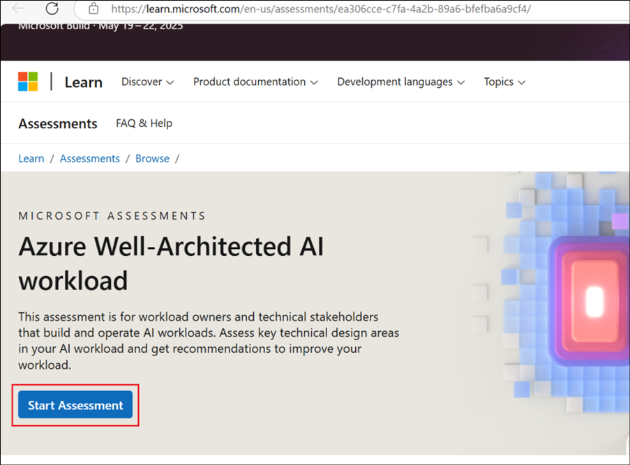
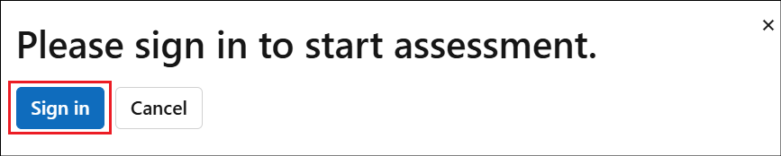
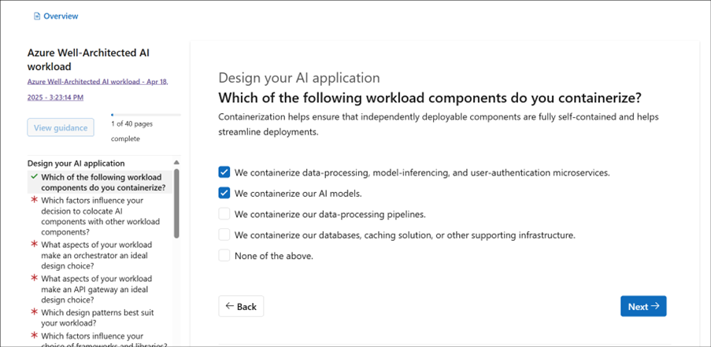
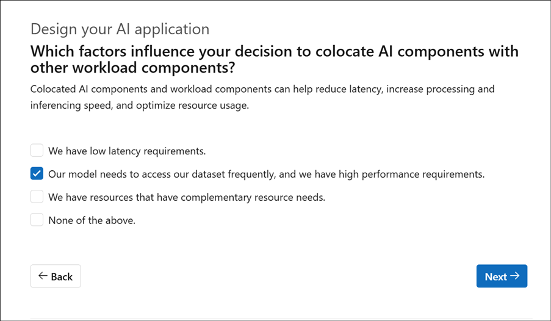
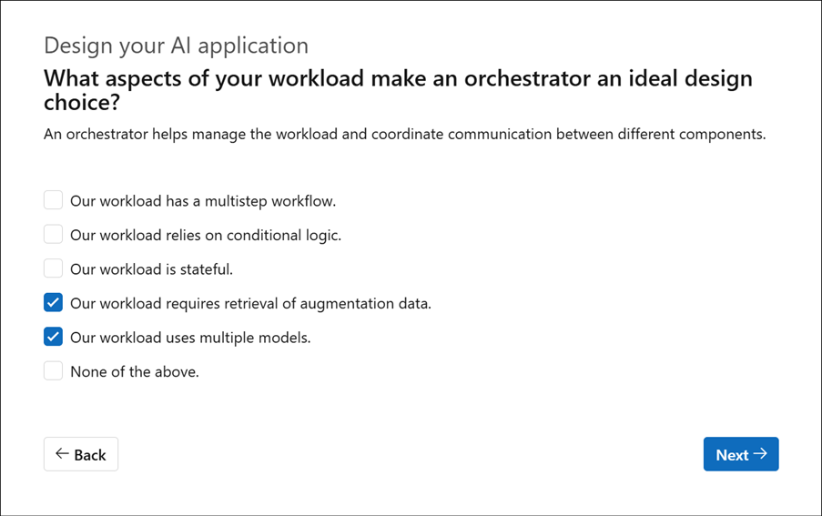
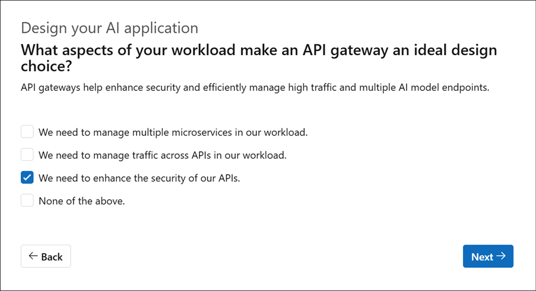
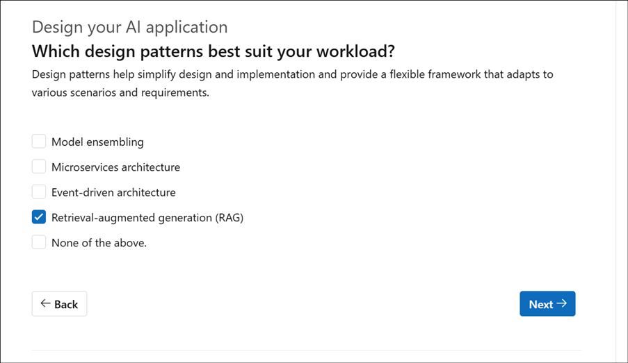
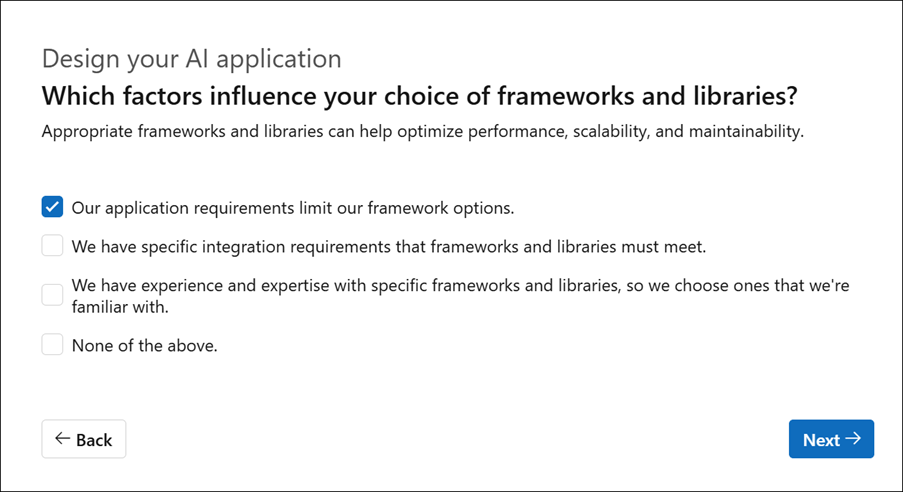
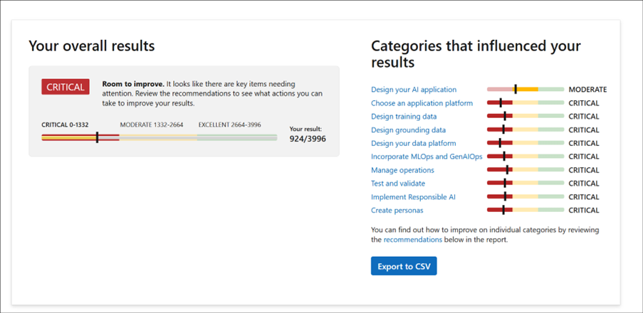

## Exercise 3:  WAF AI Workload assessment

1.	From a browser, navigate to +++https://learn.microsoft.com/en-us/assessments/ea306cce-c7fa-4a2b-89a6-bfefba6a9cf4/+++ and select **Start Assessment**.

    
  	
2.	Select **Sign in** to start.

     
  	
3.	Signing in using personal id is encouraged so that the data can be retained.

4.	There are **different categories** of questions.

5.	Select an option for each of the questions based on your workload requirements like in the screenshots below.

    

    

    
 
    
  	
    

 
    
 

7. There are a total of 40 questions. Select an answer for each one of them based on your scenario.
   
8. Once all the questions are answered, you will receive the **results** based on your requirements, categorized appropriately with recommendations for each.  

    
  	
9.	Scroll down to know more details on the same.
